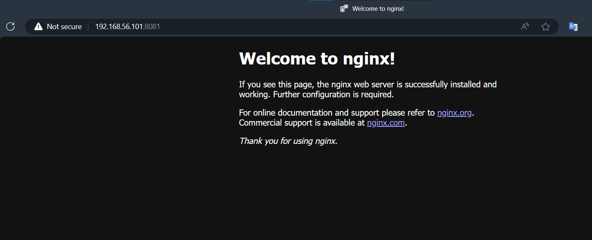

# Deploy một Service đơn giản

Trong bài này, chúng ta sẽ sử dụng nginx, một web server phổ biến, làm service để deploy.

Trên máy Manager, hãy mở terminal và chạy lệnh sau để tạo một service mới với tên my-web:

```bash
docker service create --name my-web --publish 8081:80 nginx
```

Ở đây, `--publish 8081:80`` nghĩa là chúng ta đang map cổng 8081 trên máy host (Swarm manager) tới cổng 80 trên container nginx.

Để kiểm tra ta dùng lệnh:

```bash
docker service ls
```
Kết quả:

```bash
ID             NAME            MODE         REPLICAS   IMAGE                           PORTS
jdf9lqt5nsgf   my-web          replicated   1/1        nginx:latest                    *:8081->80/tcp
```

Giờ hãy mở trình duyệt web trên máy thật, gõ url `192.168.56.101:8081` (192.168.56.101 chính là ip tĩnh của máy `manager01`) các bạn sẽ thấy giao diện của Nginx:



Hoặc ở trong máy ảo manager bạn cũng có thể gõ lệnh:
```bash
curl localhost:8081
```

Kết quả:
```html
<!DOCTYPE html>
<html>
<head>
<title>Welcome to nginx!</title>
<style>
html { color-scheme: light dark; }
body { width: 35em; margin: 0 auto;
font-family: Tahoma, Verdana, Arial, sans-serif; }
</style>
</head>
<body>
<h1>Welcome to nginx!</h1>
<p>If you see this page, the nginx web server is successfully installed and
working. Further configuration is required.</p>

<p>For online documentation and support please refer to
<a href="http://nginx.org/">nginx.org</a>.<br/>
Commercial support is available at
<a href="http://nginx.com/">nginx.com</a>.</p>

<p><em>Thank you for using nginx.</em></p>
</body>
</html>
```

Nếu có vấn đề, bạn có thể xem logs của service bằng cách sử dụng:
```bash 
docker service logs my-web
# my-web là tên của service bạn muốn xem logs
```
