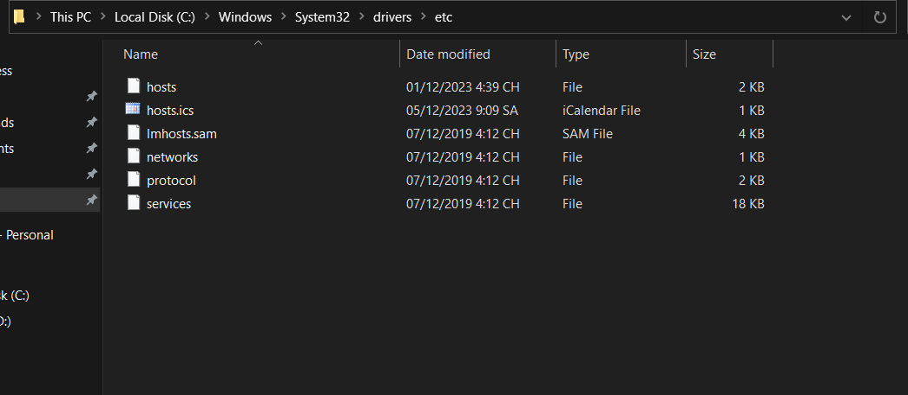
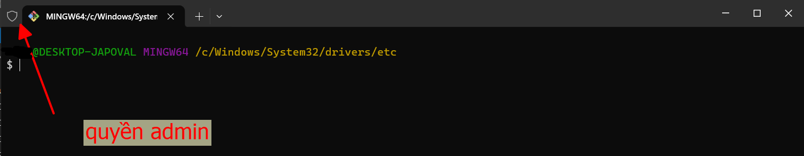
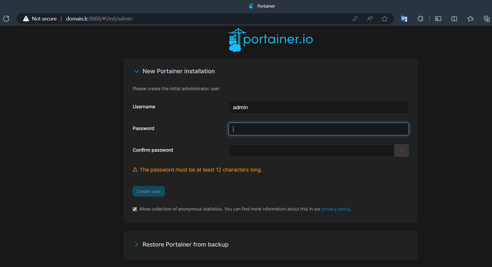
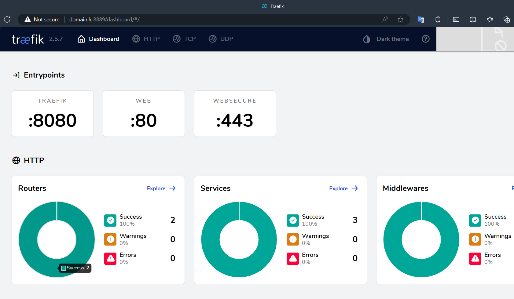
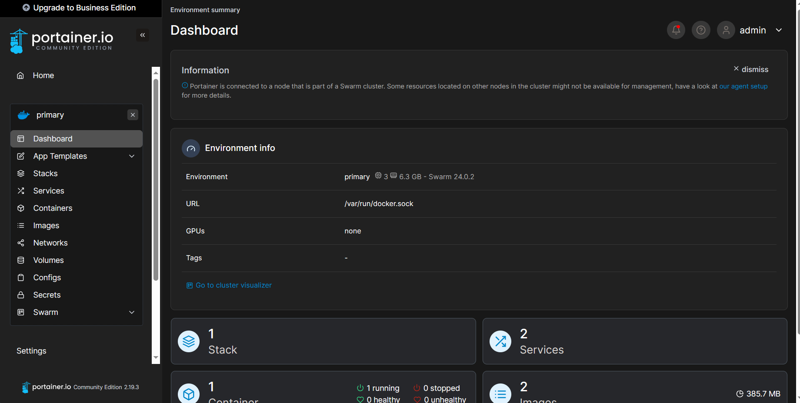
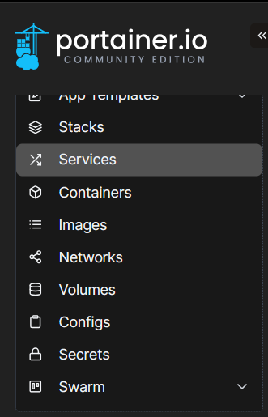

Khi làm việc với Docker Swarm, chúng ta nên sử dụng Portainer để dễ dàng quản lý Docker environment. Bên cạnh đó chúng ta cũng cần sử dụng một reverse-proxy cũng như là load balancer, vậy nên ta sẽ sử dụng Traefik.

Trong bài tập này, ta sẽ deploy hai service này lên. Trong đây đã có sẵn một file là `reverse-proxy` chứa cấu hình traefik và một file `protainer-agent-stack` chứa cấu hình của portainer.

## 1. Cài đặt DNS

Để có thể theo vào được giao diện của `portainer` và `traefik` một cách trực quan nhất, ta sẽ truy cập thông qua browser trên máy thật. Nhưng thay vì cứ phải nhập địa chỉ ip `192.168.56.101` thì ta sẽ đổi nó thành một tên miền, cụ thể ở đây là `domain.lc`

Bây giờ các bạn cần sửa file `/etc/hosts` trên máy thật của các bạn để có thể mở được các subdomain này. 

### 1.1 Với hệ điều hành linux/macOS thì cần sửa dưới quyền root với câu lệnh:

```bash
nano /etc/hosts
```

### 1.2 Với hệ điều hành windows

Các bạn cần mở file hosts trong đường dẫn `C:\Windows\System32\drivers\etc`:



Bởi vì file này chỉ được chỉnh sửa dưới quyền admin, vậy nên các bạn có thể mở CMD hoặc Terminal dưới quyền admin lên để sửa:



Sau đó dùng lệnh:
```bash
nano hosts
```
Vào chỉnh sửa file hosts, ta sẽ thêm hai subdomain ở trên với cú pháp:

```bash
<địa chỉ ip> <tên miền>
```

Ví dụ ở đây tôi đặt tên miền là `domain.lc`


## 2. Deploy reverse-proxy stack

Bây giờ chúng ta sẽ vào trong máy ảo `manager01`, sau đó cd vào thư mục chứa file `reverse-proxy.yml` rồi gõ lệnh:

```bash
docker stack deploy -c reverse-proxy.yml reverse-proxy
```

Bây giờ các bạn sử dụng browser ở máy thật, nhập địa chỉ `portainer.lc:9000` thì sẽ có kết quả:



Nhập địa chỉ `traefik.lc:8888` thì có kết quả:



Như vậy là truy cập thành công.
Sau khi tạo tài khoản thì ta đăng nhập vào portainer. 

Đây là giao diện của portainer:



Ta có thể dễ dàng xem các services, containers, images, networks, v.v... mà không cần phải gõ lệnh nhiều lần:


