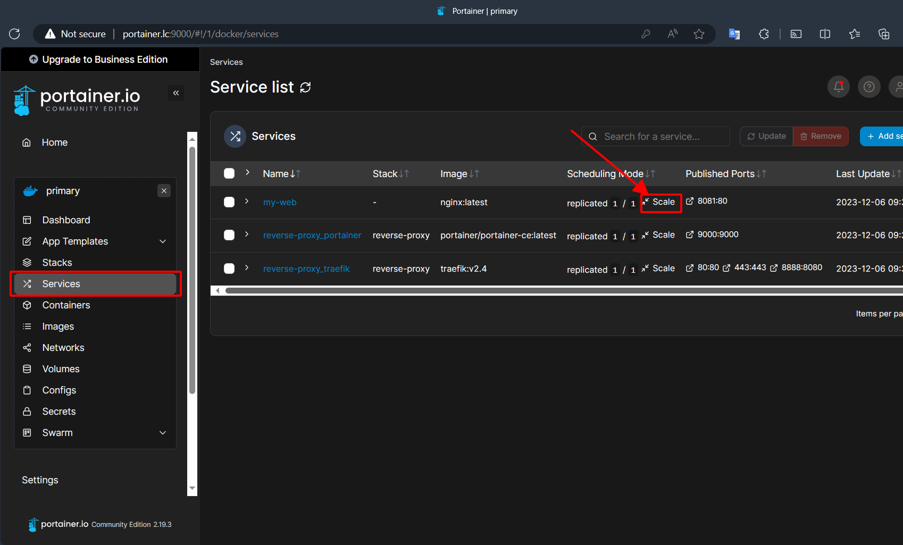
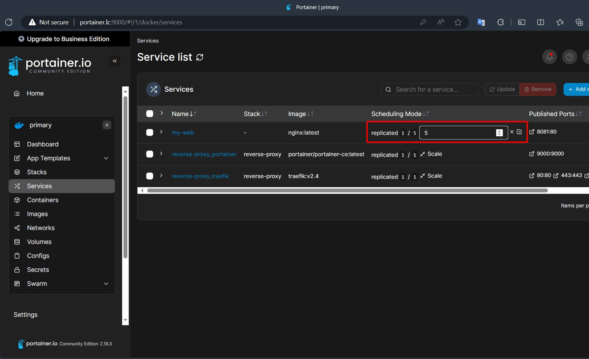
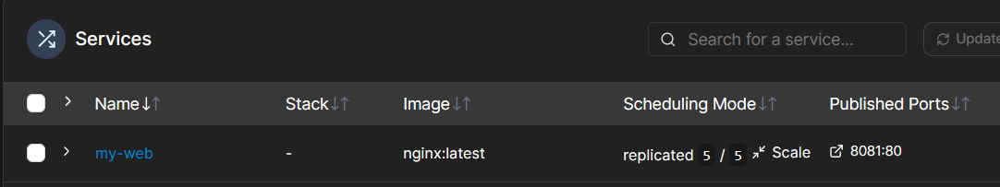
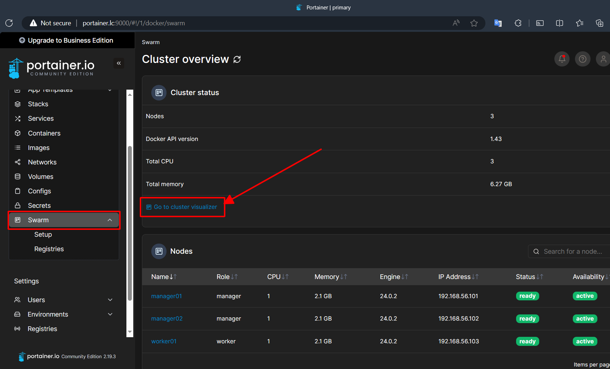
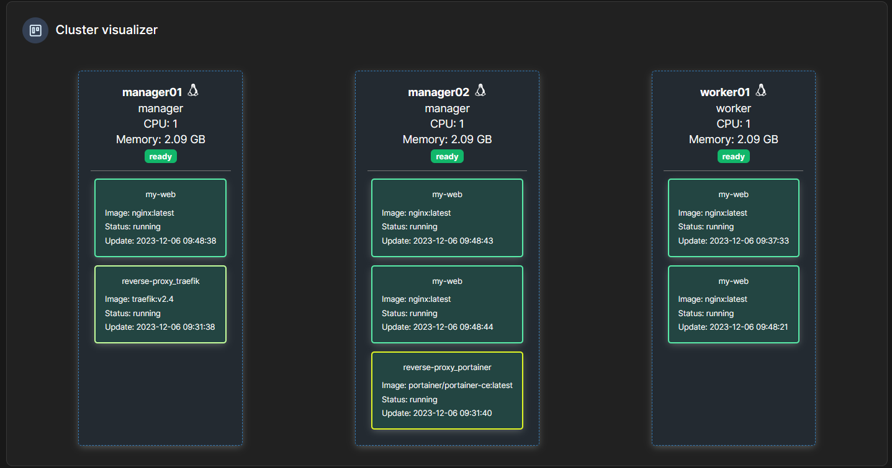
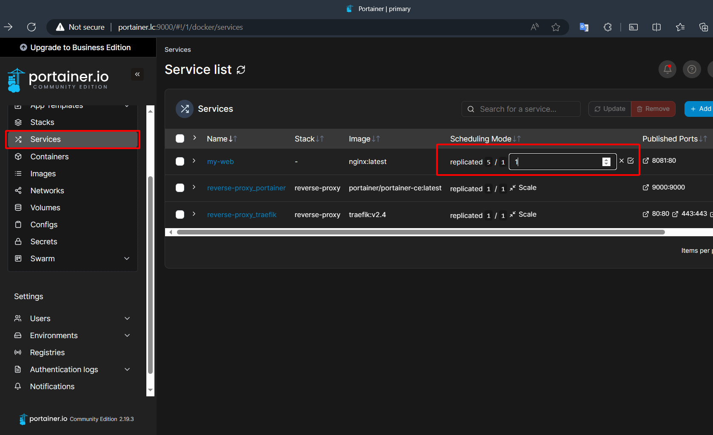

# Quản lý Services
Ta sẽ quản lý services nginx từ [bài 02](https://github.com/lekien-2803/docker-swarm-practice/tree/main/02-deploy-simple-service).

## 1. Scale up một service: 
Ta gõ lệnh:

```bash
docker service scale my-web=5

# (tăng số replicas lên 5)
```

Sau đó ta kiểm tra danh sách service bằng lệnh:

```bash
docker service ls

# Kết quả:
ID             NAME            MODE         REPLICAS   IMAGE                           PORTS
jdf9lqt5nsgf   my-web          replicated   5/5        nginx:latest                    *:8081->80/tcp
```

Hoặc bạn có thể làm trên Portainer -> Services -> chọn `my-web` -> chọn `Scale`




Như vậy ta thấy service này được scale up lên thành 5 replicas.



Bấm vào `Swarm` -> `Go to cluster visualizer` để xem 5 replicas của nginx được chia đều cho ba máy như thế nào:





## 2. Scale down một service: 
Ta dùng lệnh:

```bash
docker service scale my-web=1 
# (giảm số replicas xuống 1)
```

Hoặc chỉnh sửa trên Portainer như trên:


## Mục đích:

Giúp bạn hiểu rõ về cách quản lý và điều chỉnh các services trong một cluster Docker Swarm. Cụ thể, bài tập này tập trung vào việc scale up (tăng số lượng replicas của một service) và scale down (giảm số lượng replicas của một service). Điều này quan trọng vì:

- Hiểu về Scalability: Scalability là khả năng của một hệ thống để xử lý tăng hoặc giảm workload một cách linh hoạt. Trong Docker Swarm, điều này thường được thực hiện bằng cách tăng hoặc giảm số lượng replicas của một service.

- Quản lý Tài nguyên: Khi workload thay đổi, việc điều chỉnh số lượng replicas giúp đảm bảo rằng các tài nguyên hệ thống (như CPU và bộ nhớ) được sử dụng một cách hiệu quả.

- Đảm bảo Độ sẵn sàng và Hiệu suất: Tăng số lượng replicas có thể giúp cải thiện độ sẵn sàng và khả năng chịu lỗi của service. Ngược lại, giảm số lượng replicas có thể hữu ích trong các trường hợp khi cần giảm tài nguyên sử dụng mà không ảnh hưởng đến hiệu suất.

- Học cách Phản ứng với Các Yêu cầu Thay đổi: Trong môi trường thực tế, yêu cầu đối với các ứng dụng thường xuyên thay đổi. Có khả năng điều chỉnh số lượng replicas của services nhanh chóng và dễ dàng là kỹ năng quan trọng.

- Thực hành Các Lệnh Docker Swarm: Việc thực hành các lệnh để scale services giúp bạn làm quen hơn với giao diện dòng lệnh của Docker Swarm và cách thức quản lý cluster.