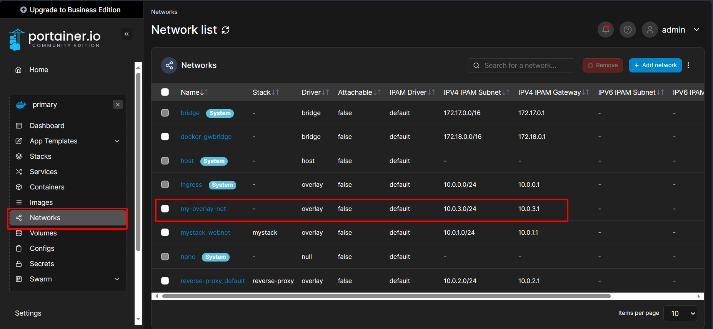
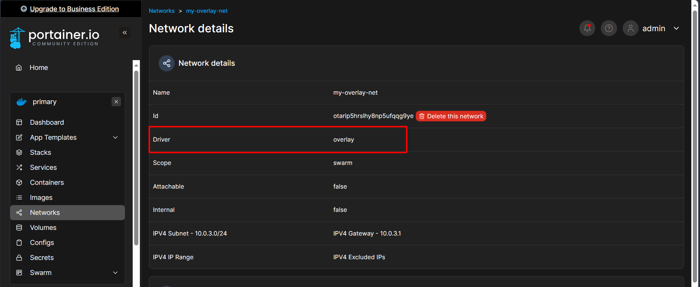
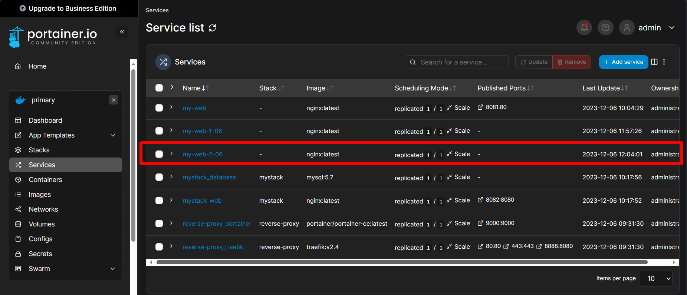

# Làm việc với Docker Networking
Ở bài này ta sẽ tập trung vào việc tạo và quản lý overlay networks trong Docker Swarm. Overlay network cho phép các containers trên các Docker hosts khác nhau giao tiếp với nhau một cách an toàn.

## 1. Tạo Overlay Network
Trên máy `manager01` của Docker Swarm, mở terminal và chạy lệnh sau để tạo một overlay network. Đặt tên cho network của bạn, ví dụ ở đây là `my-overlay-net`:

```bash
docker network create --driver overlay my-net-06
```

Trên Portainer, ta vào menu `Networks` kiểm tra xem có `my-overlay-net` hay chưa:



Bấm vào `my-overlay-network` để xem thông tin, ta thấy driver của network này là `overlay`.



## 2. Deploy Services sử dụng Overlay Network

Bây giờ ta sẽ deploy một service đơn giản và kết nối với `my-overlay-network` vừa tạo.

Deploy một service (ví dụ: một nginx web server) và kết nối nó với overlay network:

```bash
docker service create --name my-web-1-06 --network my-net-06 nginx
```

Bấm vào service `my-web-01-06`:


Kéo xuống các bạn sẽ thấy Network đang sử dụng là `my-overlay-network`:


Giờ ta sẽ chạy thêm một container dạng `nginx` nữa để kiểm tra mạng, ta sẽ đặt tên service này là `my-web-2-06`:

```bash
docker service create --name my-web-2-06 --network my-net-06 nginx
```



## 3. Kiểm tra kết nối mạng

Theo lý thuyết, nếu các services ở chung một network thì có thể "nhìn" thấy nhau, tức là có thể ping tới nhau được.

Để kiểm tra xem các containers có thể giao tiếp với nhau qua overlay network hay không, bạn cần thực hiện exec vào một container và thử ping tới container khác.

Tìm một container đang chạy của service `my-web-1-06`:

```bash
docker ps
```

Kết quả:
```bash
root@manager02:~# docker ps
CONTAINER ID   IMAGE                           COMMAND                  CREATED       STATUS       PORTS                          NAMES
c071e784e60c   nginx:latest                    "/docker-entrypoint.…"   4 hours ago   Up 4 hours   80/tcp                         my-web-1-06.1.r6ec5yq26plm5zlpg7xzegkeb
ef1bf448c1e0   portainer/portainer-ce:latest   "/portainer -H unix:…"   6 hours ago   Up 6 hours   8000/tcp, 9000/tcp, 9443/tcp   reverse-proxy_portainer.1.l897aw149y7k47olb3y8oim9d
```

Exec vào container này (thay thế `[CONTAINER_ID]` với ID thực tế của container vừa tìm ở trên):

```bash
docker exec -it [CONTAINER_ID] /bin/bash
```

Sau khi "chui" vào được bên trong container rồi thì chúng ta dùng lệnh ping tới service `my-web-2-06`:

```bash
ping my-web-2-06
```

*Nhớ là ping tên/id service chứ không phải ping tới container nhé.

Kết quả:

```bash
64 bytes from 10.0.4.5 (10.0.4.5): icmp_seq=1 ttl=64 time=0.042 ms
64 bytes from 10.0.4.5 (10.0.4.5): icmp_seq=2 ttl=64 time=0.070 ms
64 bytes from 10.0.4.5 (10.0.4.5): icmp_seq=3 ttl=64 time=0.053 ms
64 bytes from 10.0.4.5 (10.0.4.5): icmp_seq=4 ttl=64 time=0.062 ms
64 bytes from 10.0.4.5 (10.0.4.5): icmp_seq=5 ttl=64 time=0.057 ms
```

Như vậy là đã ping được tới service `my-web-2-06`, tức là chúng ở chung một network.

*Lưu ý: Làm đến đây có thể các bạn sẽ gặp bug, hãy sang tab [issue]() của repo này xem nhé.*