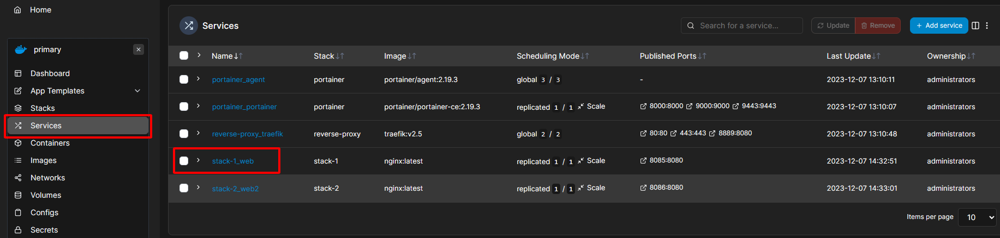

# Làm việc với Docker Networking
Ở bài này ta sẽ tập trung vào việc tạo và quản lý overlay networks trong Docker Swarm. Overlay network cho phép các containers trên các Docker hosts khác nhau giao tiếp với nhau một cách an toàn.

## 1. Tạo Overlay Network
Trên máy `manager01` của Docker Swarm, mở terminal và chạy lệnh sau để tạo một overlay network. Đặt tên cho network của bạn, ví dụ ở đây là `my-overlay-net`:

```bash
docker network create --driver overlay my-net-06
```

Trên Portainer, ta vào menu `Networks` kiểm tra xem có `my-net-06` hay chưa:


## 2. Deploy Services sử dụng Network vừa tạo

Bây giờ ta sẽ deploy hai service đơn giản có sẵn trong folder 06 này. Hai service này sẽ được config dưới dạng file `YAML`, cụ thể ở đây là `stack1.yml` và `stack2.yml`

Deploy service (ví dụ: một nginx web server) và kết nối nó với network vừa tạo ở trên:

```bash
docker stack deploy -c stack-1.yml stack-1
```

```bash
docker stack deploy -c stack-2.yml stack-2
```

Bấm vào service `stack-1_web`:



Kéo xuống các bạn sẽ thấy Network đang sử dụng là `my-net-06`:


Các bạn kiểm tra tương tự với service `stack-2_web2`.

## 3. Kiểm tra kết nối mạng

Theo lý thuyết, nếu các services ở chung một network thì có thể "nhìn" thấy nhau, tức là có thể ping tới nhau được.

Để kiểm tra xem các containers có thể giao tiếp với nhau qua overlay network hay không, bạn cần thực hiện exec vào một container và thử ping tới container khác.

*Lưu ý: Làm đến đây có thể các bạn sẽ gặp bug, hãy sang tab [issue]() của repo này xem nhé.*

Giờ ta sang menu `Container` và chọn `stack-2_web2`:


Sau đó chọn vào nút `Console`:


Chọn `Connect`:


Sau đó gõ lệnh:

```bash
ping stack-1_web
```

Ở đây, `stack-1_web` là tên service của `stack-1` ở trên, các bạn nhớ là ping tên hoặc id của service chứ không phải của container nhé.

Làm đến đây có thể các bạn sẽ gặp lỗi, hãy qua phần [issue](https://github.com/lekien-2803/docker-swarm-practice/issues/3) để xem cách giải quyết.

Kết quả:


Như vậy là chúng ta đã ping được tới service còn lại cùng nằm trong network tên là `my-net-06`.