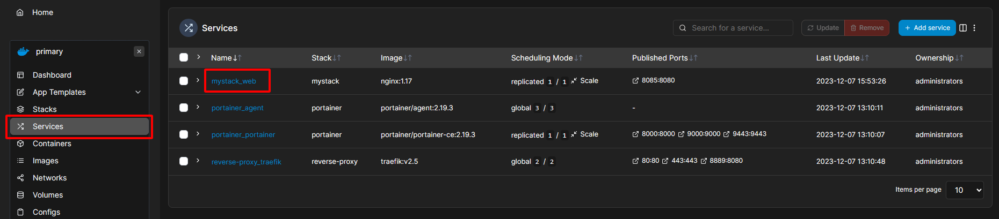
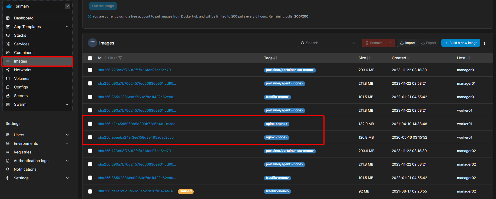
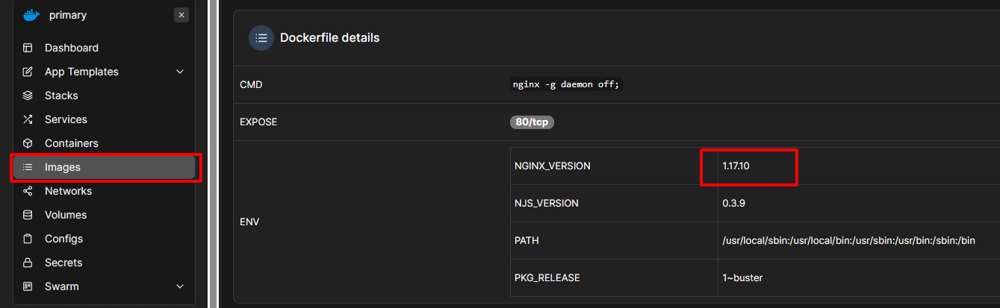
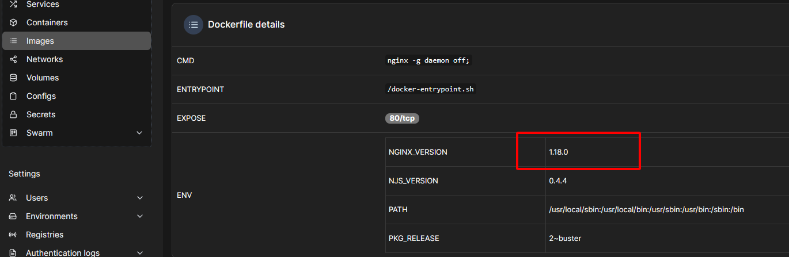
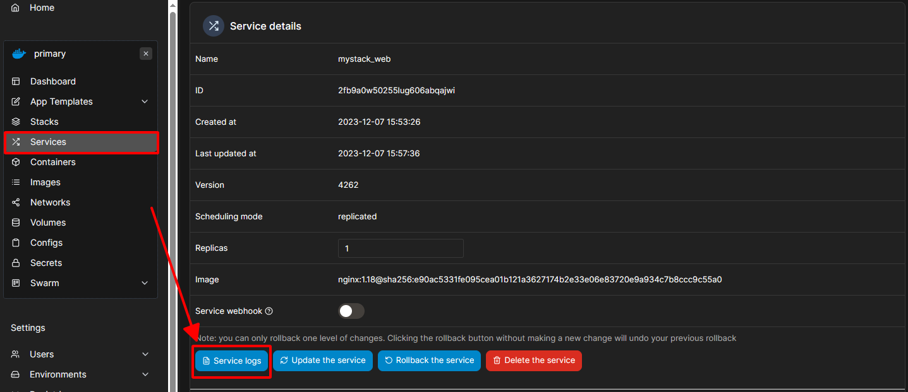
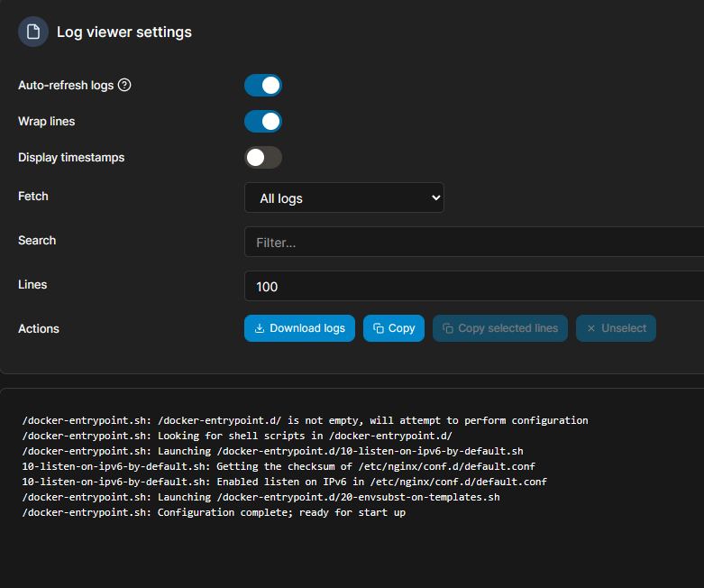
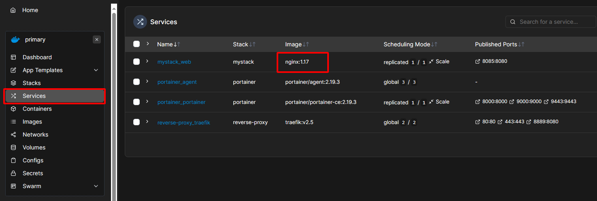

# Cập nhật Service

Bài này tập trung vào việc thực hiện cập nhật cho các services trong Docker Swarm, sử dụng kỹ thuật rolling update để đảm bảo sự liên tục và không gián đoạn của ứng dụng.

## 1. Triển khai service ban đầu

Đầu tiên ta cần một service đang chạy trong Swarm. Hãy deploy service web nginx trong file `docker-compose.yml` có trong folder này.

```bash
docker stack deploy -c docker-compose.yml mystack
```

Ok, sau khi deploy thì ta có service `mystack_web` rồi:



## 2. Cập nhật service

Giả sử bạn muốn cập nhật service của mình lên phiên bản mới hơn của nginx. Sử dụng lệnh `docker service update`:

```bash
docker service update --image nginx:1.18 mystack_web
```

Ở đây, chúng ta cập nhật image của service từ `nginx:1.17` sang `nginx:1.18`.

## 3. Kiểm tra phiên bản images

Các bạn vào menu `Images` sẽ thấy có hai images của `nginx`:



Bấm vào từng image để xem thông tin phiên bản:





## 4. Troubleshooting và Rollback nếu cần

Ta có thể xem service logs tại menu `Services`:



Xem logs:



Nếu bạn phát hiện ra vấn đề sau khi cập nhật, bạn có thể quay trở lại phiên bản trước đó của service:

```bash
docker service update --image nginx:1.17 mystack_web
```

Ta sẽ lại thấy phiên bản `nginx:1.17`:

