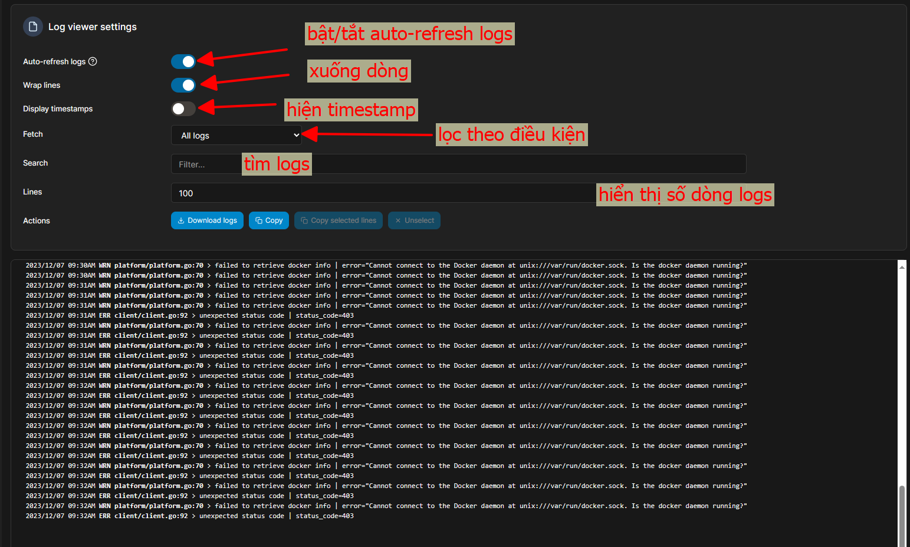

# Tìm hiểu về Docker Service Logs

Bài tập số 8 tập trung vào việc xem và phân tích logs của các services trong Docker Swarm. Đây là một phần quan trọng trong việc quản lý và troubleshooting services.

## 1. Xem logs của service

Như bài 07 cũng đã nói qua về cách xem service logs trên giao diện của Portainer rồi. 

Cụ thể trong bài này ta cùng xem service logs của `portainer` nhé:

Sau khi vào rồi thì ta có thể nhìn thấy logs của service này. Trong giao diện này có khá là nhiều bộ lọc cho chúng ta:

* Ví dụ: Khi tôi tìm từ khóa `"error"` thì sẽ hiện ra các kết quả có chứa từ khóa này:

## 2. Phân tích Logs
### Tìm kiếm thông tin quan trọng:
Trong logs, tìm kiếm các thông tin về lỗi, cảnh báo, hoặc các thông tin khác mà có thể giúp bạn hiểu rõ về trạng thái và hoạt động của service.

### Xác định nguyên nhân của lỗi: 
Nếu có lỗi, hãy sử dụng thông tin trong logs để xác định nguyên nhân và tìm cách giải quyết.

