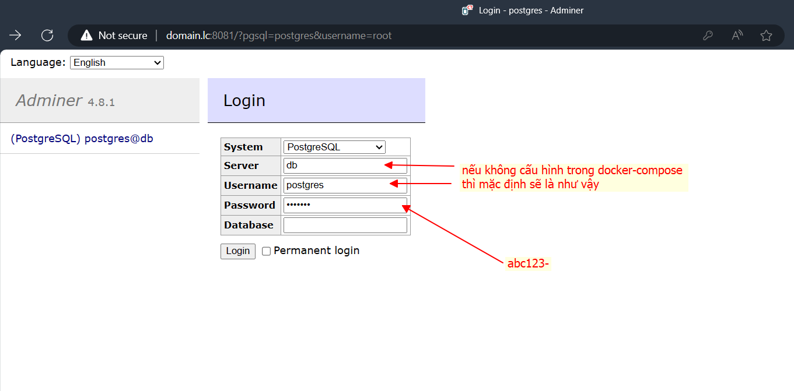
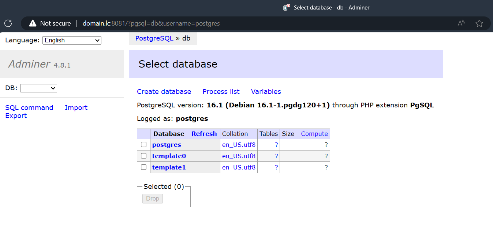
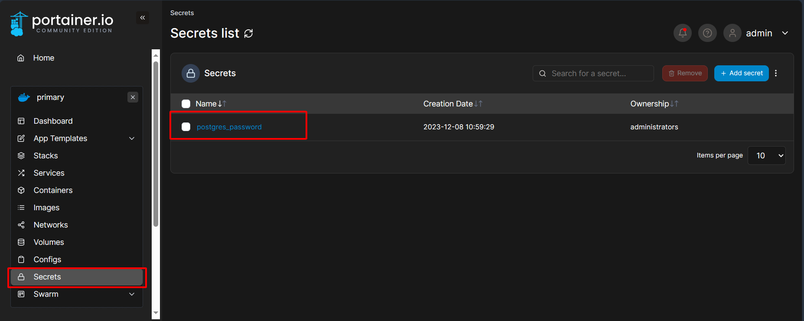

# Sử dụng Docker Secret

"Dùng Docker Secret", liên quan đến việc tạo và quản lý "secrets" trong Docker Swarm. Secrets là cách để lưu trữ và quản lý thông tin nhạy cảm như mật khẩu, token, SSH keys và các thông tin xác thực khác, giúp chúng không bị lộ trong code hoặc trong các lệnh Docker. 

Trong bài này, ta sẽ làm một ví dụ về Docker Secrets với PostgreSQL. 

## 1. Tạo Docker Secret

### 1.1. Tạo file tạm chứa mật khẩu

Đầu tiên các bạn tạo một file tạm thời tên là `postgres_password.txt` trên máy ảo `manager01`:

```bash
nano postgres_password.txt
```

Sau đó ghi mật khẩu để đăng nhập vào của các bạn vào file này, ví dụ như của tôi sẽ là "abc123-":

```
abc123-
```

***Lưu ý: Đảm bảo rằng không có ký tự xuống dòng hoặc khoảng trắng thừa trong file.***

### 1.2. Tạo Docker Secret từ file `postgres_password.txt`:

```bash
docker secret create postgres_password postgres_password.txt
```

Ở đây, `postgres_password` là tên của secret.

### 1.3. Xóa file tạm vừa tạo

Sau khi tạo secret, xóa file tạm để đảm bảo rằng mật khẩu không còn tồn tại trên hệ thống của bạn:

```bash
rm postgres_password.txt
```

***Lưu ý:  Đảm bảo rằng file tạm này không được lưu trữ hoặc commit vào hệ thống quản lý mã nguồn. Vậy nên xóa đi là cách tốt nhất.***

## 2. Deploy service PostgreSQL

Ở trong folder này đã có file `docker-compose.yml` cấu hình sẵn một service postgres và adminer đơn giản. Các bạn cd vào folder bài 09 này và sử dụng lệnh để deploy:

```bash
docker stack deploy -c docker-compose.yml postgres
```

Ok, bây giờ ta sẽ sử dụng browser trên máy thật, truy cập vào url `domain.lc:8081`:



Nếu đăng nhập vào thành công thì có nghĩa là docker secret đã thực hiện đúng chức năng của mình:



Kiểm tra trong menu `Secrets` là sẽ thấy tên của secret ta vừa tạo:



## Lưu ý:
- Secret trong Docker không được mã hóa trong quá trình truyền tải giữa client và Docker Swarm manager. Đảm bảo rằng kết nối của bạn an toàn (ví dụ, sử dụng HTTPS).

- Docker secret chỉ được hỗ trợ trong Swarm mode.

- Secrets không thể bị thay đổi một khi đã được tạo, nếu cần thay đổi, bạn phải tạo secret mới.