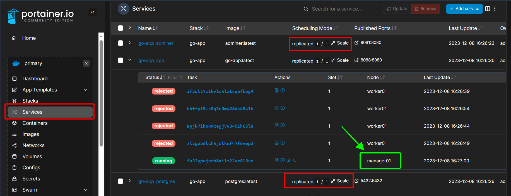
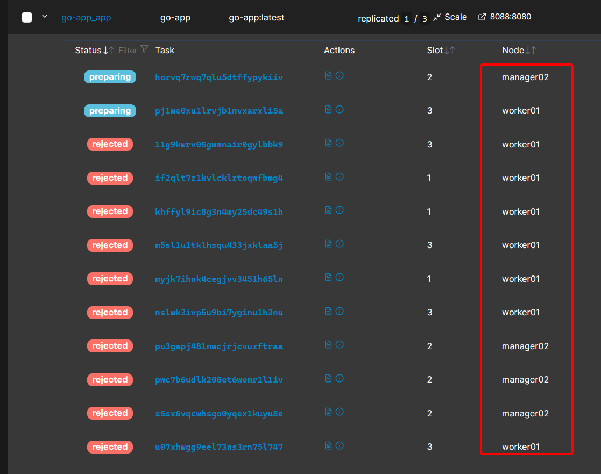

#  Sử dụng Docker Registry

Từ đầu đến giờ chúng ta mới chỉ deploy những service đơn giản, sử dụng những images có sẵn trên Docker Hub nên các service này luôn chạy ổn định, kể cả khi chúng ta có đột ngột tắt một máy ảo đi chăng nữa, Swarm cũng sẽ tự điều chỉnh service đồng đều cho hai máy còn lại.

Tuy nhiên, trong thực tế web app của chúng ta phải tự làm, do đó image cho web app đó chúng ta phải tự build từ `Dockerfile`.

Ta sẽ cùng làm bài tập này để hiểu lý do vì sao cần sử dụng Docker Registry.

## 1. Sử dụng local image

Trong folder bài này có chứa một folder `simple-app` có chứa một golang web app, một file `init-data.sql` để khởi tạo bảng và dữ liệu, `docker-compose.yml` và `Dockerfile`.

Giờ ta sẽ cd vào repo này, nơi có chứa cả `docker-compose.yml` và `Dockerfile`.

Trước hết là cần phải build ra được image cho web app từ `Dockerfile`:


```bash
docker build -t go-app:latest .
```

* `go-app` là tên image và nó phải trùng với tag image của service `app` ở trong file docker-compose.yml

Sau khi có image, ta sẽ deploy lên bằng lệnh:

```bash
docker stack deploy -c docker-compose.yml go-app
```

Như các bạn có thể thấy, hai services `adminer` và `postgres` đã có sẵn image trên Docker Hub nên chúng có thể dễ dàng chạy trên bất kì node nào.

Nhưng service `go-app` của chúng ta chỉ có thể chạy trên node `manager01` - cũng chính là node mà ta vừa build ra được image của `go-app`:



Ngay cả khi chúng ta scale up thì cũng không thể hoạt động ở trên hai node còn lại được:



* Liên tục bị rejected

Bấm vào các task bị rejected thì ta thấy:


Vì vậy ta phải thiết lập Registry để các node khác cũng có thể sử dụng được image này.

Trước hết thì nên xóa stack này đi đã:

```bash
docker stack rm go-app
```

## 2. Thiết lập Private Docker Registry

Chạy Private Docker Registry trên node `manager01`:

```bash
docker run -d -p 5000:5000 --name registry registry:2
```

## 3. Tag và push image vào Registry

Tag image `go-app` vào Registry:

```bash
docker tag go-app localhost:5000/go-app
```

Push image vào Registry:

```bash
docker push localhost:5000/go-app
```

## 4. Cấu hình các Node Swarm để trust Registry

Ta truy cập vào hai máy node còn lại là `manager02` và `worker01`. 

Sau đó chỉnh sửa hoặc tạo file `/etc/docker/daemon.json` trên mỗi node:

```bash
{
  "insecure-registries" : ["192.168.56.101:5000"]
}
```

Ta restart Docker Daemon trên mỗi node:

```bash
sudo systemctl restart docker
```

## 5. Deploy lại go-app

Ta sẽ chỉnh sửa lại riêng serivce `app` trong file `docker-compose.yml` một chút:

```bash
version: '3.3'
services:
    # service khác

  app:
    image: 192.168.56.101:5000/go-app
    # các tag khác
    deploy:
      replicas: 3
      labels:
        - "traefik.enable=true"
        - "traefik.http.routers.myapp.rule=Host(`domain.lc`)"
        - "traefik.http.services.myapp.loadbalancer.server.port=8088"
    # các tag khác

    # service khác
```

Sau đó deploy lại và đây là kết quả:


