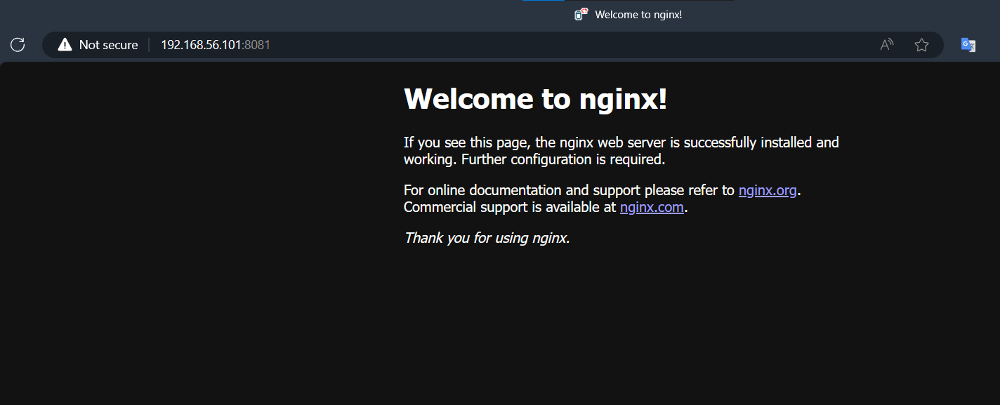

# Thực hành với docker-swarm
*Yêu cầu: Đã có 3 máy ảo ubuntu, chi tiết có thể tham khảo tại [đây](https://github.com/lekien-2803/docker-swarm-practice/blob/main/vagrant.md).*
## I. Cơ bản
### 1. Cài đặt Docker 

Vì trong Vagrantfile đã có sẵn lệnh khởi chạy cài đặt docker rồi nên ta không cần cài thủ công nữa.

### 2. Tạo một Swarm Cluster

Khởi tạo docker swarm với lệnh:
```
docker swarm init --advertise-addr <ip của máy làm manager>
```

Sau khi lệnh được thực thi, sẽ có một câu lệnh được trả về có dạng:
```
Swarm initialized: current node (rh9krtfftxhjvb25t7k6y8gxs) is now a manager.

To add a worker to this swarm, run the following command:

    docker swarm join --token SWMTKN-1-0t08e9l15ta4refv1y7jms78er7iguz8wsdrdjunkitylh5wrf-63zl0jxp7retpn7ov6sequk3e 192.168.56.101:2377

To add a manager to this swarm, run 'docker swarm join-token manager' and follow the instructions.
```

*Lưu ý: đoạn token này ở máy của bạn có thể khác ví dụ.*

Lấy token dành cho worker:
```
docker swarm join-token worker
```

Lấy token dành cho manager:
```
docker swarm join-token manager
```

Mở thêm tab terminal để truy cập vào máy `manager02` và `worker01`. Tại máy `worker01` ta sẽ sử dụng đoạn lệnh
```
docker swarm join --token SWMTKN-1-0t08e9l15ta4refv1y7jms78er7iguz8wsdrdjunkitylh5wrf-63zl0jxp7retpn7ov6sequk3e 192.168.56.101:2377
```
để biến máy `worker01` trở thành worker node trong docker swarm, làm tương tự với máy `manager02` nhưng sử dụng token dành cho manager.

Sử dụng lệnh để kiểm tra thông tin các node:
```
docker node ls

ID                            HOSTNAME    STATUS    AVAILABILITY   MANAGER STATUS   ENGINE VERSION
29fdrzibeubab1jc6nf25lotd *   manager01   Ready     Active         Leader           24.0.2
n0ddmq3i2knka9k0scnpl90q8     manager02   Ready     Active         Reachable        24.0.2
uejoqcuzhomza7jaztjvyzzfj     worker01    Ready     Active                          24.0.2
```

### 3. Deploy một Service đơn giản

Trong bài này, chúng ta sẽ sử dụng nginx, một web server phổ biến, làm service để deploy.

Trên máy Manager, hãy mở terminal và chạy lệnh sau để tạo một service mới với tên my-web:

```
docker service create --name my-web --publish 8081:80 nginx
```

Ở đây, `--publish 8081:80`` nghĩa là chúng ta đang map cổng 8081 trên máy host (Swarm manager) tới cổng 80 trên container nginx.

Để kiểm tra ta dùng lệnh:
```
docker service ls
```
Kết quả:
```
ID             NAME            MODE         REPLICAS   IMAGE                           PORTS
jdf9lqt5nsgf   my-web          replicated   1/1        nginx:latest                    *:8081->80/tcp
```

Giờ hãy mở trình duyệt web trên máy thật, gõ url `192.168.56.101:8081` (192.168.56.101 chính là ip tĩnh của máy `manager01`) các bạn sẽ thấy giao diện của Nginx:



Hoặc ở trong máy ảo manager bạn cũng có thể gõ lệnh:
```
curl localhost:8081
```

Kết quả:
```
<!DOCTYPE html>
<html>
<head>
<title>Welcome to nginx!</title>
<style>
html { color-scheme: light dark; }
body { width: 35em; margin: 0 auto;
font-family: Tahoma, Verdana, Arial, sans-serif; }
</style>
</head>
<body>
<h1>Welcome to nginx!</h1>
<p>If you see this page, the nginx web server is successfully installed and
working. Further configuration is required.</p>

<p>For online documentation and support please refer to
<a href="http://nginx.org/">nginx.org</a>.<br/>
Commercial support is available at
<a href="http://nginx.com/">nginx.com</a>.</p>

<p><em>Thank you for using nginx.</em></p>
</body>
</html>
```

aaaa